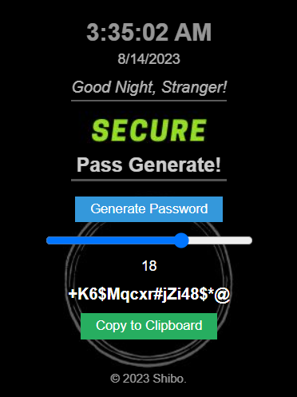

Google Chrome Password Generater Extension
========================

A simple Google Chrome extension that greets you, shows time and generate random password strings according to your need. 
### To Install

For development:

1. Clone this repo
2. Open up Chrome and go to the extensions page (Window → Extensions)
3. Enable developer mode (if it’s not already)
4. Click on “Load unpacked extension…”
5. Select the folder for this app

<h2>Output</h2>

  

*   Please report any bugs that you find as issues on the project
*   ©Shibo. 2023
